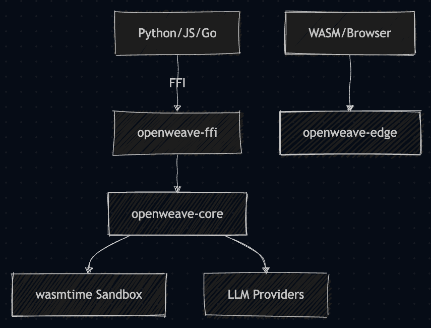

# OpenWeave

High-performance OSS AI agent framework.

## Architecture



## Install

### Python
`pip install openweave`
```python
from openweave import Agent
agent = Agent(llm="openai/gpt-4o")
print(agent.run("hello"))
```

### Node.js
`npm install openweave`
```javascript
import { Agent } from 'openweave';
const agent = new Agent({ llm: "openai/gpt-4o" });
agent.run("hello").then(console.log);
```

### Go
`go get github.com/openweave/go/openweave`
```go
import "github.com/openweave/go/openweave"
agent, _ := openweave.New(openweave.AgentConfig{LLM: "openai/gpt-4o"})
res, _ := agent.Run("hello")
fmt.Println(res)
```

### Rust
`cargo add openweave-core`
```rust
use openweave_core::agent::{Agent, AgentConfig};
use openweave_core::llm::openai::OpenAIProvider;
use std::sync::Arc;
let agent = Agent::new(Arc::new(OpenAIProvider::new("gpt-4o")));
let res = agent.run("hello").await?;
```